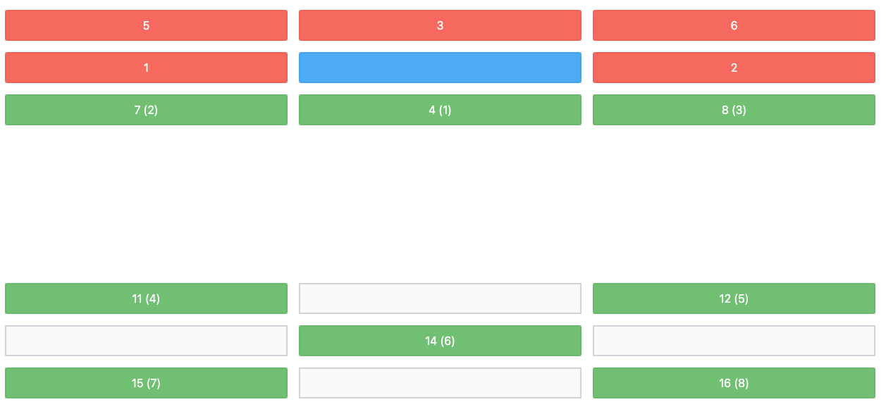

# ArrowTab

**ArrowTab** allows you to navigate a webpage using the arrow keys, automatically selecting the nearest focusable element. This enables fast and efficient keyboard-only navigation across the page.

ArrowTab is particularly **useful for business applications**, where power users need to prioritize **high productivity**.

Instead of hitting `Tab` repeatedly, you can simply use the arrow keys to indicate the direction and jump to the next input, button, or link you want to select.

ArrowTab's default settings work well, but they are not always a plug-and-play solution. It helps if you build your app with ArrowTab in mind. For example, aligning your focusable elements into a grid and considering the placement of your navigation. The idea is to integrate ArrowTab into your app from the beginning, not to add it as an afterthought.

## Input Behavior Changes

ArrowTab slightly modifies the behavior of some input elements to enhance keyboard navigation. For example, number inputs will not change their value when using the up and down arrow keys; instead, the focus will move to the element above or below.

To revert to the native behavior, press `Shift` + `Arrow Key`.

## Installation

pnpm:

```sh
pnpm install arrowtab
```

yarn:

```sh
yarn add arrowtab
```

npm:

```sh
npm install arrowtab
```

## Usage

Vanilla JS:

```ts
import { initArrowTab } from 'arrowtab'

initArrowTab()
```

React:

```tsx
'use client'

import { useEffect } from 'react'
import { initArrowTab } from 'arrowtab'

export const ArrowTab = () => {
  useEffect(() => {
    const { cleanup } = initArrowTab()

    return () => {
      cleanup()
    }
  }, [])

  return null
}
```

### Cleanup

If you want to remove the ArrowTab event listener, you can call the `cleanup` function. This is useful if you use ArrowTab in a `useEffect` hook.

```ts
const { cleanup } = initArrowTab()

cleanup()
```

## Options

You can pass options to the `initArrowTab` function. For example:

```ts
initArrowTab({ debug: true })
```

### debug

default: `false`

If debug is set to `true`, ArrowTab will log debug information to the console. It also enables the visual debug mode. To activate the visual debug mode, press `Ctrl` + `Arrow Key`. For example, `Ctrl` + `Arrow Down` will highlight all the focusable elements.

Here is an example:

<div style="padding:10px; background:white; border-radius:4px; margin-bottom:1rem">
  
</div>

Blue indicates the current element. Green indicates focusable elements that are within reach, and red indicates those that are not within reach.

The numbers represent the order of the focusable elements. The numbers in parentheses represent the order of the focusable elements that are within reach. Lower numbers are closer to the current element.

If you click on a focusable element, debug information will be logged to the console.

To deactivate the visual debug mode, press `Esc`.

## data-arrowtab

You can control the behavior of ArrowTab by adding a `data-arrowtab` attribute to any element. Separate the keywords with a space. For example: `<div data-arrowtab="disable-left disable-right">`

Here are the available keywords:

### disable, disable-${key}

Sometimes your components are listening to arrow keys themselves. In that case, you can disable ArrowTab for that element by adding the `disable` attribute.

If you only want to disable a specific key, then use: `disable-left`, `disable-right`, `disable-up`, `disable-down`.

## Development

```sh
pnpm dev
```

A demo page will open in your browser at `http://localhost:8080`.

If you want to use the library in your app, you can use the following code:

```ts
import { initArrowTab } from 'http://localhost:8080/dist/index.js'

initArrowTab()
```

Or as a script tag:

```html
<script type="module">
  import { initArrowTab } from 'http://localhost:8080/dist/index.js'

  initArrowTab()
</script>
```
